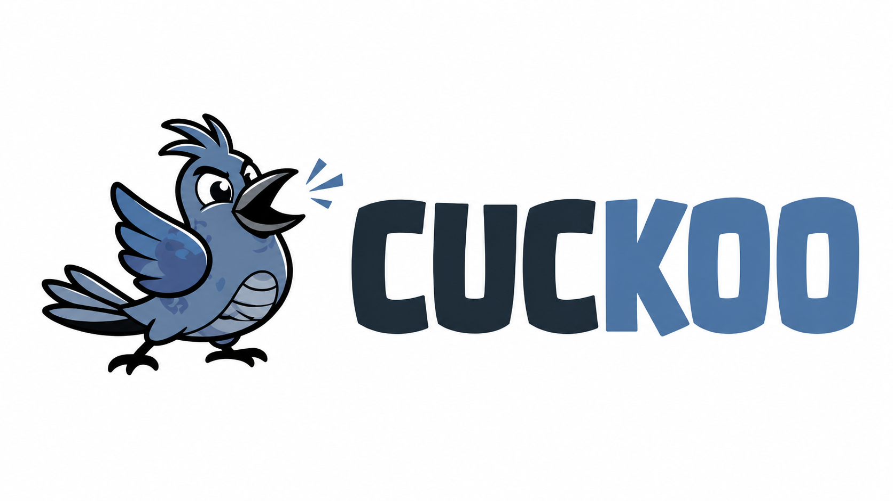

<p align="center">
  
</p>

# Cuckoo

[中文文档](README.zh-CN.md)

Cuckoo is a local-first ecommerce image translation service. It reads Chinese text from product images, translates it to English, removes the original text region, and writes the translated text back onto a high-resolution copy of the original image.

The first implementation is intentionally practical:

- FastAPI backend with batch upload APIs.
- Static web workbench served by the backend.
- PaddleOCR-based text recognition, adapted from the short-drama OCR pipeline patterns.
- OpenAI-compatible or DeepL translation providers, with a mock provider for local UI testing.
- OpenCV/Pillow image repair and text rendering.
- Local storage by default, with a clean storage boundary for S3/GCS later.

## Quick Start

```powershell
python -m venv .venv
.\.venv\Scripts\Activate.ps1
pip install -r requirements.txt
copy .env.example .env
uvicorn app.main:app --reload --host 127.0.0.1 --port 8000
```

Open `http://127.0.0.1:8000`.

## Translation Providers

For local UI testing, leave `TRANSLATOR_PROVIDER=mock`. The mock provider marks translations so the workflow can be verified without spending API credits.

For an OpenAI-compatible translation API such as 302.ai Qwen-MT:

```env
TRANSLATOR_PROVIDER=openai
TRANSLATE_ENDPOINT=https://example.com/v1/chat/completions
TRANSLATE_API_KEY=your-key
TRANSLATE_MODEL=qwen-mt-plus
```

For DeepL:

```env
TRANSLATOR_PROVIDER=deepl
DEEPL_API_KEY=your-key
DEEPL_API_URL=https://api-free.deepl.com/v2/translate
```

## API

- `POST /api/jobs`: upload 1-30 images and start a background translation job.
- `GET /api/jobs/{job_id}`: read progress and result metadata.
- `GET /api/jobs/{job_id}/download`: download all generated images as a zip.
- `GET /health`: service health check.

## Notes

- Only OCR regions containing CJK characters are replaced, so existing English labels and non-text image content are left untouched.
- Output resolution matches the source image resolution.
- The in-memory job store is suitable for local development and coursework demonstration. For production, replace it with Celery/RQ plus PostgreSQL or Redis.
- Uploads and outputs are stored under `data/` by default. This can be moved behind S3/GCS without changing the OCR pipeline.
